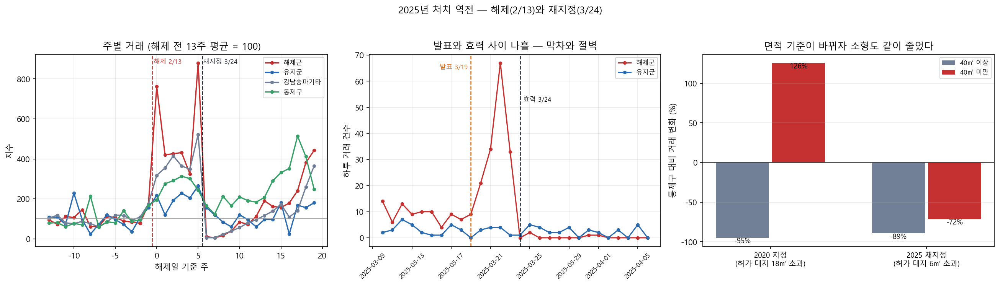
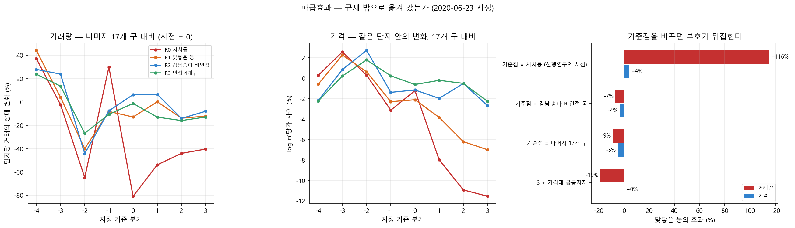

# 4주차 결과 보고서

**서울 아파트 실거래와 정책 공고를 결합한 미시 패널 구축과 토지거래허가구역 인과효과 추정**

2026-09-23 · 4주차 (D-58) · 저장소 https://github.com/cosmicpotato2047/capstone-ltz-causal

원자료 스냅샷: 실거래 2026-09-03 수집(분석 8개 자치구 472,782건 · 서울 25개 자치구 1,407,186건), 공고는 2026-08-20 공고분(국토교통부 제2026-1105호)까지. 이 보고서의 숫자는 이 스냅샷 기준이다.

---

## 요약

**2차 마일스톤(M2)을 목표보다 3주 앞당겨 채웠다.** 2025년 해제·재지정 구간과 파급효과 분해를 모두 끝냈다. 결과는 다섯 가지다.

1. **규제가 다시 걸리자 거래가 끊겼다.** 2025-03-24 재지정 직후 5주 동안 처치동 거래가 **−78.9%**(같은 동의 유지 단지 대비). 발표(3/19)와 효력(3/24) 사이 나흘에 막차가 다섯 배로 몰렸다가 효력일부터 하루 0~2건으로 떨어진다.

2. **지난주에 적어 둔 예측이 맞았다.** 3주차 보고서(09/18)는 "2020년 지정은 대지 18㎡ 초과만 허가 대상이라 소형이 빠져나갔고, 2025년은 처음부터 6㎡라 소형도 줄어야 한다"고 적었다. 실제로 소형 효과가 **2020년 +125.7% → 2025년 −71.5%**로 뒤집혔다. 결과를 보기 전에 세운 예측이다.

3. **파급은 같은 동 안에만 있었다.** 2025년 2월 해제 때 규제가 유지된 16개 단지는 규제가 하나도 바뀌지 않았는데 거래가 **−26.5%** 줄었다. 바로 옆 단지의 규제가 풀리자 수요가 그쪽으로 옮겨 간 것이다. 반면 처치동에 맞닿은 동은 어느 사양에서도 늘지 않았다.

4. **선행연구의 '인근 급등'은 기준점이 만든 말이다.** 맞닿은 동의 거래는 **처치동을 기준에 두면 +115.5%**, **서울 나머지 19개 구를 기준에 두면 −9.0%**다. 같은 자료, 같은 창, 같은 사양이고 무엇과 견주는지만 다르다. 옆 동이 늘어서가 아니라 처치동이 58% 줄어서 그렇게 보인다.

5. **가격에서 숙제가 하나 생겼다.** 같은 가격대끼리 견주면 처치동의 가격 효과가 −9.7%에서 **−2.1%(비유의)**로 약해진다. 거래량은 −57.8%에서 −63.7%로 그대로다. 가격대 효과인지 처치의 일부인지 지금 자료로는 가르지 못한다.

**이번 주의 성격.** 두 항목 모두 제안서가 적어 둔 설계가 자료와 맞지 않았고, 설계를 바꿔야 했다. 바꾼 이유와 버린 설계를 결정기록에 그대로 남겼다.

---

## 1. 제안서의 설계를 두 번 바꿨다

두 항목 다 **분석을 짜기 전에 원자료부터 봤고**, 그때 계획이 안 되는 것을 알았다.

| 항목 | 제안서의 계획 | 바꾼 것 | 왜 |
|---|---|---|---|
| 9 · 2025 구간 | **해제**(2/13)를 주 사건으로, 재건축 여부를 세 번째 축으로 | **재지정**(3/24)을 주 사건으로, **전용면적**을 세 번째 축으로 | 해제 구간에는 움직이지 않은 비교군이 없다. 유지군에 소형 거래가 0건이라 재건축 축을 못 세운다 |
| 12 · 파급효과 | 인접 지역과 견준다 | **기준점을 서울 전체로** 옮기고, 세 층으로 나눈다 | 인접만 기준에 두면 '인근이 올랐다'와 '처치동이 눌렸다'를 못 가른다 |

제안서가 정한 마일스톤 M2의 목표("2025년 해제·재지정의 삼중차분 결과와 파급효과 분해")는 그대로 충족된다. 삼중차분은 하되 축과 사건이 달라졌다.

> 자세히: [결정기록 0023](https://github.com/cosmicpotato2047/capstone-ltz-causal/blob/main/docs/decisions/0023-2025-처치역전-재지정중심.md) · [0024](https://github.com/cosmicpotato2047/capstone-ltz-causal/blob/main/docs/decisions/0024-파급효과-기준점.md)

---

## 2. 2025년 — 규제가 풀렸다가 다시 걸렸다

### 2.1 39일짜리 창

2025-02-13 서울시는 국제교류복합지구 토허구역을 대부분 해제하면서 재건축 추진 단지 16개만 남겼다. 39일 뒤인 2025-03-24 강남3구·용산 전 아파트를 다시 묶었다. 처치가 1 → 0 → 1로 뒤집힌 드문 구간이다.

이 구간의 집단은 넷이다.

| 집단 | 2/13 해제 | 3/24 재지정 |
|---|---|---|
| 해제군 (처치 4개 동의 유지군 아닌 단지) | 규제 → **무규제** | 무규제 → **규제** |
| 강남·송파 나머지 동 | 변화 없음 (무규제) | 무규제 → **규제** |
| 유지군 16개 단지 | 변화 없음 (규제) | 변화 없음 (규제) |
| 비처치 4개 구 (강동·성동·광진·동작) | 변화 없음 (무규제) | 변화 없음 (무규제) |

**해제 쪽은 재지 못한다.** 해제 후 5주 동안 해제군 거래가 4.73배로 뛰었는데, 규제와 아무 상관 없는 비처치 4개 구도 **2.76배** 올랐다. 2025년 2~3월은 서울 전체가 오르던 때다. 통제군을 무엇으로 두느냐에 따라 추정치가 +31.3% ~ +145.6%로 벌어지고, 앞선 해의 같은 날짜에 건 가짜 사건에서도 비슷한 크기가 나온다. **"해제 뒤 거래가 늘었다"까지만 쓴다.**

**재지정 쪽은 반대다.** 이때는 변하지 않은 집단이 둘 있다 — 유지군 16개와 비처치 4개 구.

### 2.2 재지정 직후 거래는 끊겼다

| 처치 | 통제 | 기저 | 효과 | p |
|---|---|---|---|---|
| **해제군** | **유지군 16개** | **정상 13주** | **−78.9%** | 0.000 |
| 해제군 | 유지군 16개 | 해제창 5주 | −92.3% | 0.000 |
| 해제군 | 비처치 4개 구 | 정상 13주 | −86.1% | 0.000 |
| 강남·송파 전체 | 비처치 4개 구 | 정상 13주 | −87.9% | 0.000 |

**기저를 무엇으로 두느냐가 −79%와 −92%를 가른다.** 재지정 직전 5주는 해제로 과열된 구간이라 그것을 기저로 쓰면 낙폭이 커진다. 주 사양은 해제 이전의 정상 구간을 기저로 한 **−78.9%**다.

**발표와 효력 사이 나흘에 막차가 몰렸다.**

| 집단 | 3/15~18 | 3/20~23 (발표 후) | 3/24~27 (효력 후) |
|---|---|---|---|
| 해제군 | 30건 | **155건** | **2건** |
| 강남·송파 나머지 동 | 114건 | **268건** | **0건** |
| 유지군 16개 | 10건 | 12건 | 12건 |
| 비처치 4개 구 | 146건 | 134건 | 67건 |

새로 규제될 집단만 닷새 안에 다섯 배로 몰렸다가 효력일에 끊겼다. 규제를 받지 않는 두 집단은 움직이지 않는다. 2020년 공고와 효력 사이 닷새의 막차가 훨씬 크게 반복됐다.

### 2.3 다만 여섯 주짜리 충격이다

사후를 12주로 늘리면 유지군 대비 −14.1%(p=0.370)까지 줄어든다. 거래는 재지정 후 6주쯤 얼어 있다가 5월부터 돌아온다. **"지속"이 아니라 "직후"의 숫자다.**



### 2.4 통제군이 결론을 만들지 않았는가

유지군 16개는 서울시가 재건축 추진을 보고 고른 집단이지 무작위가 아니다. 그래서 유지군 대신 비처치 4개 구에서 16개 단지를 무작위로 뽑아 통제군으로 쓰는 일을 2,000번 반복했다.

| | 가짜 중위 | 2.5% | 97.5% | 실제(유지군) |
|---|---|---|---|---|
| 재지정 효과 | −86.8% | −93.1% | −71.6% | **−78.9%** (86번째 백분위) |

실제값은 가짜 분포 안에 있고, 가짜 통제군 쪽이 더 큰 감소를 낸다. **유지군을 쓰는 편이 보수적이다.**

> 자세히: [결정기록 0023](https://github.com/cosmicpotato2047/capstone-ltz-causal/blob/main/docs/decisions/0023-2025-처치역전-재지정중심.md)

---

## 3. 지난주 예측이 맞았다

3주차 보고서(결정기록 0022)는 효과가 단지마다 달랐던 주된 이유를 **허가 대상의 면적 기준**으로 결론지었다. 2020년 지정은 주거지역 대지 18㎡ 초과만 허가 대상이라 대지지분이 작은 소형이 사실상 규제 밖이었다는 것이다. 그리고 그 결론이 옳다면 따라 나오는 예측을 함께 적어 두었다.

> 2025년 재지정은 처음부터 6㎡ 기준이다. 소형 면제가 없으므로 **2025년에는 소형도 대형과 같이 줄어야 한다.**

같은 통제군(비처치 4개 구)에 같은 사양을 두 사건에 걸었다. 창은 사전 13주 · 사후 5주로 같다.

| 사건 | 허가 대상 | 40㎡ 이상 | 40㎡ 미만 | 차이 계수 | p |
|---|---|---|---|---|---|
| 2020-06-23 지정 | 대지 18㎡ 초과 | −95.0% | **+125.7%** | +3.818 | 0.000 |
| 2025-03-24 재지정 | 대지 6㎡ 초과 | −89.4% | **−71.5%** | +0.987 | 0.388 |

**2020년에 소형은 줄지 않은 정도가 아니라 늘었다.** 허가 대상이 아니었으므로 규제를 피하려는 수요가 소형으로 몰린 것으로 읽는다. 2025년에는 그 통로가 닫혀 있었고 소형도 −71.5% 줄었다. 소형이 덜 줄어든 폭(차이 계수)이 3.818에서 0.987로 내려앉고 통계적으로 유의하지 않게 된다.

**사후에 맞춘 설명이 아니다.** 결과를 보기 전에 결정기록에 적어 둔 예측이고, 그 예측이 다른 사건·다른 연도·다른 통제군에서 확인됐다. 이 연구가 "규제를 거느냐가 아니라 어떻게 거느냐가 효과를 정한다"고 말할 근거가 한 겹 두꺼워졌다.

다만 **소형 거래는 2020년 75건, 2025년 111건뿐이다.** 방향은 믿을 만하지만 크기는 아니다. 2025년의 차이 계수가 0과 구분되지 않는 것도 표본이 작아서일 수 있다. 그래서 "소형이 대형과 똑같이 줄었다"가 아니라 **"2020년과 달리 소형도 크게 줄었다"**로 쓴다.

---

## 4. 어디로 번졌는가

토허제의 명분은 가격 안정이다. 규제 밖 단지로 수요가 옮겨 갔을 뿐이라면 규제는 문제를 푼 것이 아니라 **옮긴 것**이다. 선행연구 두 편이 '인근 지역 급등'을 보고했다.

### 4.1 규제 밖이 세 층으로 있다

층마다 사건이 다르다. 법정동 경계 다각형으로 처치 4개 동에 맞닿은 동을 뽑으니 14개였다.

| 층 | 사건 | 규제 밖에 무엇이 | 답 |
|---|---|---|---|
| **같은 동 안** | 2025-02 해제 | 유지군 16개 단지 | **있다** — 거래 −26.5% (p<0.001) |
| **옆 동** | 2020-06 지정 | 맞닿은 11개 동 | **없다** — −9.0%, 공통지지에서 −19.0% |
| **옆 구** | 2025-03 재지정 | 인접 4개 구 | **모른다** — +23.0% (p=0.157) |

**층 1이 이 연구에서 가장 가까이서 잰 파급이다.** 유지군 16개는 규제가 하나도 바뀌지 않았는데, 바로 옆 단지의 규제가 풀리자 거래가 26.5% 줄었다. 같은 동, 같은 학군, 같은 시기다. 제안서가 "파급효과를 인접 지역이 아니라 동일 지역 내에서 측정할 수 있는 조건"이라 쓴 것이 이것이고, 이번에 처음 쟀다.

**반면 한 층만 멀어져도 파급이 없다.** 2020년 지정에서 맞닿은 동은 어느 사양에서도 거래가 늘지 않았다.

### 4.2 같은 자료에서 정반대 결론이 나온다

기준점만 바꿔 가며 같은 계산을 반복했다. 맞닿은 동이고, 자료·창·사양이 모두 같다.

| 기준점 | 거래량 | 가격 |
|---|---|---|
| **① 처치동** | **+115.5%** (0.000) | +4.3% (0.111) |
| ② 강남·송파 비인접 동 | −6.8% (0.331) | −3.6% (0.055) |
| ③ 나머지 19개 구 | −9.0% (0.088) | −5.0% (0.001) |
| ④ ③ + 가격대 공통지지 | −19.0% (0.021) | +0.3% (0.748) |

**①이 '인근 급등'이다.** 맞닿은 동의 거래가 처치동보다 116% 많아진 것은 사실이다. 그런데 그것은 옆 동이 늘어서가 아니라 **처치동이 58% 줄어서**다. 옆 동은 가만히 있어도 상대적으로 두 배가 된다. 기준점을 서울 전체로 한 칸 옮기면 −9%가 된다.

처치동으로 같은 사다리를 놓으면 거래량은 기준점을 어떻게 바꿔도 −57 ~ −64%다. **주 결과는 이 사다리에서 움직이지 않는다.**



### 4.3 선행연구와의 관계

**본문 결과와는 어긋나지 않는다.** 9월 3일에 세 논문의 지역 정의를 이 자료에 그대로 적용해 본 적이 있다. 어떻게 바꾸어도 전부 음수였고 단지 고정효과를 넣으면 −6 ~ −7%로 모였다. 어긋나는 것은 **'인근 급등'이라는 서술 하나**다.

**비난이 아니라 서술 관행의 문제로 다룬다.** 인근만 기준에 두면 '인근이 올랐다'와 '처치동이 눌렸다'를 구분할 수 없다. 서울 전체를 기준에 놓아야 갈린다. 그리고 **동 단위 집계 자료로는 이 사다리를 만들 수 없다** — 처치동 바깥 서울 전역의 단지를 같은 표에 놓아야 하기 때문이다. 미시 패널이 답한 또 하나의 질문이다.

> 자세히: [결정기록 0024](https://github.com/cosmicpotato2047/capstone-ltz-causal/blob/main/docs/decisions/0024-파급효과-기준점.md) · 용어: [기준점 · 공통지지](https://github.com/cosmicpotato2047/capstone-ltz-causal/blob/main/docs/glossary.md)

---

## 5. 가격에서 생긴 숙제

처치동 아파트는 서울 최상위 가격대에 몰려 있고, 2020~2021년은 중저가가 급등하고 고가가 뒤처진 시기다. 그래서 지정 전 ㎡당가가 처치동 범위(1,142~2,649만원)에 드는 단지만 남겨 다시 쟀다. 통제군은 서초·마포·양천·용산 등 19개 구의 440개 단지 14,804건이다.

| | 전체 표본 | 가격대 공통지지 |
|---|---|---|
| 거래량 | −57.8% (0.000) | **−63.7%** (0.000) |
| 가격 | −9.7% (0.000) | **−2.1%** (0.270) |

**거래량은 단단하고 가격은 약해진다.** 읽는 방법이 둘이다.

- 토허제의 가격 효과로 보였던 것이 사실은 2020~21년 고가 단지가 뒤처진 것이다
- 규제가 고가 단지에 걸렸으니 가격대를 맞추는 것은 처치의 일부를 빼는 것이다

**지금 자료로는 가르지 못한다.** 두 사양을 나란히 싣고, 1주차에 정한 대로 가격은 방향만 말한다. 가르는 일은 헤도닉 지수(백로그 8)와 사전 추세 민감도 분석(11)의 몫이며 M3에서 다룬다.

**버린 사양을 밝혀 둔다.** 가격대를 통제하려고 처음에는 가격 10분위 × 시점 고정효과를 넣었다. 처치동 가격 효과가 −1.0%까지 사라지길래 확인해 보니, **최상위 분위 거래의 20.3%가 처치동이고 처치동과 맞닿은 동을 합치면 49.4%**였다. 처치가 제 통제군이 되어 효과를 기계적으로 흡수하는 구조다. 고정효과로 빼는 대신 표본을 줄여 비교 대상을 명시적으로 고르는 쪽으로 바꿨다.

---

## 6. 이번 주에 확정된 숫자

| 무엇 | 값 | 어떻게 쟀나 |
|---|---|---|
| 2025-03-24 재지정 직후 5주 | **−78.9%** | 처치동 단지 대 같은 동 유지군 16개, 해제 전 13주 기저 |
| 같은 것, 통제군을 바꾸면 | −86.1% | 처치동 단지 대 비처치 4개 구 |
| 같은 것, 사후 12주로 늘리면 | −14.1% (p=0.370) | 6주쯤 얼었다가 5월부터 회복 |
| 재지정 막차 (발표~효력 나흘) | 30건 → **155건** → 2건 | 해제군 원자료 |
| 2020 지정 · 소형(40㎡ 미만) | **+125.7%** | 대 비처치 4개 구, 사전 13주 사후 5주 |
| 2025 재지정 · 소형 | **−71.5%** | 같은 사양 |
| 파급 · 같은 동 안 (유지군) | **−26.5%** | 대 먼 통제군, 해제 전 13주 사후 5주 |
| 파급 · 옆 동 (맞닿은 11개 동) | −9.0% ~ −19.0% | 대 나머지 19개 구, 2020 지정 ±12개월 |
| 파급 · 옆 구 (인접 4개 구) | +23.0% (p=0.157) | 대 먼 19개 구, 재지정 전후 |
| 2020 지정 거래량 (서울 기준) | −57.8% ~ **−63.7%** | 대 나머지 19개 구 / 가격대 공통지지 |
| 2020 지정 가격 (서울 기준) | −9.7% → **−2.1%** (비유의) | 전체 표본 → 가격대 공통지지 |

거래량은 포아송 유사최대우도로, 가격은 log ㎡당가에 단지·시점 고정효과를 넣어 쟀다. 클러스터는 법정동이다. 지난주까지 쓰던 log1p 선형 모형을 바꾼 이유는 규모 차이다 — 해제군 단지의 거래 중위가 2년에 2건인데 유지군은 28건이라, 칸마다 무게가 같은 모형은 거래가 드문 작은 단지에 끌려간다. 두 값을 결과 파일에 함께 저장한다.

---

## 7. 마일스톤 점검

| | 시점 | 조건 | 상태 |
|---|---|---|---|
| M1 | 09/24 | 2020년 지정의 거래량 효과를 강건성 검정과 함께 제시 | **충족** (09/18) |
| M2 | 10/15 | 2025년 해제·재지정 삼중차분과 동일 동 내 파급효과 | **충족** (09/23) |
| M3 | 11/05 | 분석 동결 | 다음 착수 |
| M4 | 11/19 | 클린 환경 재현 | `run_all.py` 31단계, 전체 재실행 확인 |

M2를 목표보다 3주 앞당겨 채웠다. 이로써 [연구의 뼈대](https://github.com/cosmicpotato2047/capstone-ltz-causal/blob/main/docs/framing.md)의 다섯 질문 중 넷이 채워졌다.

| 질문 | 지금의 답 |
|---|---|
| 얼마나 줄었나 | 직후 3개월 −71 ~ −80% |
| 언제까지 갔나 | 24개월 평균 −25 ~ −38% (범위) |
| 누구에게 달랐나 | 허가 대상 면적 기준. 2025년 재지정에서 예측 확인 |
| 어디로 번졌나 | **같은 동 안에만. 옆 동은 음수, 옆 구는 비유의** |
| 가격은 잡혔나 | **여전히 말하지 못한다. 이번 주에 오히려 더 불확실해졌다** |

---

## 8. 미해결 사항과 다음 작업

**미해결**

- **가격 효과가 가격대 통제에 약해진다.** 처치 효과인지 가격대 효과인지 가르지 못했다(5절).
- **재지정 효과는 여섯 주짜리다.** 12주로 늘리면 통제군에 따라 −14%와 −60%로 갈린다. 지속 기간은 아직 말하지 못한다.
- **소형 거래가 적다.** 2020년 75건, 2025년 111건이다.
- **옆 구로의 파급은 부호만 있다.** 창이 5주로 짧고, 늘리면 2025-06-27 대출 규제가 섞인다.
- **대지지분이 아니라 전용면적으로 대신했다.** 지난주와 같다.
- **평균 회귀와 통제군 오염을 동시에 걷어낸 24개월 사양**이 없다. 지난주와 같다.

**다음 작업 (M3, 11/05)**

| 순서 | 내용 | 받는 숙제 |
|---|---|---|
| 1 | 헤도닉 가격지수 (백로그 8) | 5절 — 특성을 명시적으로 통제해 가격대와 처치를 가른다 |
| 2 | 처치 역전 추정량 dCDH (10) | 2절의 집단 정의를 그대로 쓴다 |
| 3 | Honest DiD 민감도 구간 (11) | 5절 — 가격 효과의 강건 구간 |
| 4 | 사양 곡선 (5b) | 분석 동결 전 마지막 점검 |

10월 2일 발표에는 M1·M2 결과를 함께 넣는다.

---

## 부록: 재현

```
python run_all.py            # 정제부터 보고서까지 전부 (수집 제외)
python run_all.py --list     # 단계 목록
python run_all.py --only 12  # 한 단계만
```

이번 주에 새로 만든 분석 스크립트는 둘이다.

| 스크립트 | 무엇 | 결정기록 |
|---|---|---|
| `scripts/09_release_2025.py` | 2025 해제·재지정, 면적 기준 예측 검정 | 0023 |
| `scripts/12_spillover.py` | 파급효과 세 층 분해, 기준점 사다리 | 0024 |

추정 부품도 둘 늘었다. `scripts/lib/econ.py` 의 `ppml()`(칸 고정효과를 닫힌 식으로 흡수한 포아송)과 `scripts/lib/geo.py` 의 `touching()`(경계 다각형으로 맞닿은 법정동 찾기)이다. `ppml()`은 statsmodels로 같은 모형을 돌려 계수와 표준오차가 일치하는지 확인하고 썼다.

**전체 재실행으로 확인한 것.** M2를 채웠으므로 `run_all.py` 31단계를 처음부터 다시 돌렸다(793초). **분석 결과 파일과 그림은 하나도 바뀌지 않았다.** 다만 1·2주차 보고서 HTML 두 개가 지난주 생성기 변경분을 반영하지 않은 채 남아 있던 것을 찾아 다시 만들었다(내용은 그대로, 그림 스타일만 추가).

**작업 일지**: [2026-09-23](https://github.com/cosmicpotato2047/capstone-ltz-causal/blob/main/docs/journal/2026-09-23.md) · **지난 보고서**: [3주차](https://cosmicpotato2047.github.io/capstone-ltz-causal/docs/reports/week-03.html)
